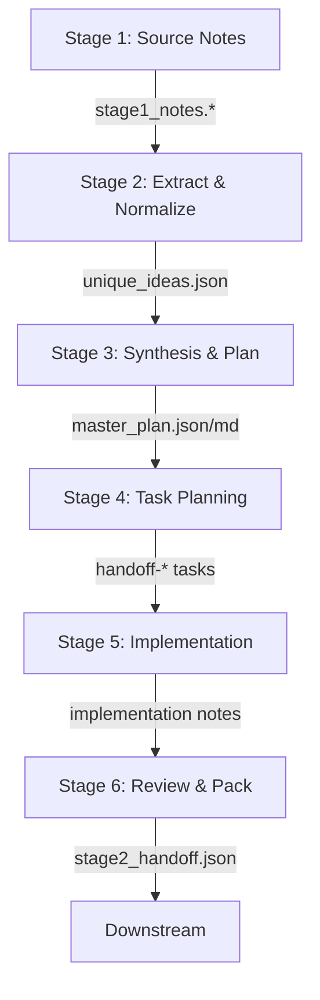
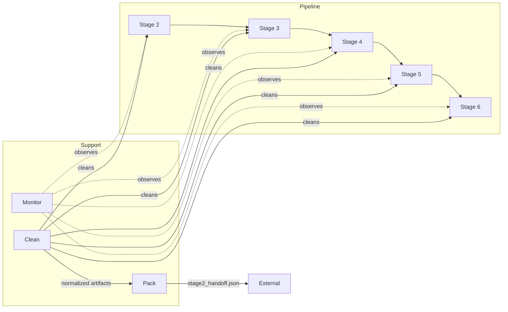

# nesting_cog_omega Orchestrator

A multi-stage AI synthesis pipeline that orchestrates multiple LLM agents to extract, normalize, synthesize, and package AI-generated content with comprehensive tracking and validation.

## Overview

The pipeline implements a **6-stage synthesis system** with clear handoffs:

1. **Stage 1**: Source notes from multiple LLM providers (Perplexity, Groq, Grok, Claude, DeepSeek)
2. **Stage 2**: Extract and normalize unique ideas
3. **Stage 3**: Synthesize a master plan with clear architecture
4. **Stage 4**: Convert master plan into tracked tasks
5. **Stage 5**: Implementation drafting
6. **Stage 6**: Review, validation, and final packaging

Plus three **cross-cutting support agents**:
- **Monitor**: Track task distribution and identify gaps
- **Clean**: Validate and normalize JSON/markdown artifacts
- **Pack**: Assemble final handoff payload

## Architecture

### Key Components

#### `nesting_cog_omega.py` (Main Orchestrator)
- Loads Stage 1 notes from `00_INBOX` and `projects/current_project`
- Orchestrates all 6 stages through the synthesis pipeline
- Manages directories, logging, and artifact persistence
- Emits final `stage2_handoff.json` for downstream systems

#### `cog_nexus.py` (Agent Runner)
Unified interface to specialized agents:
- `run_analyzer()` - Extract and deduplicate ideas (Stage 2, temp=0.1)
- `run_planner()` - Synthesize master plan (Stage 3, temp=0.15)
- `run_reviewer()` - Validate and review (Stage 6, temp=0.0)
- `run_agent()`, `run_research()`, `run_coder()` - General-purpose runners
- `run_tools()` - Tool execution wrapper
- `batch_run_agents()` - Run multiple agents in parallel

#### `cog_keys.py` (Credential Management)
Centralized API key and credential handling:
- `get_api_keys()` - Load all available keys
- `get_api_key(name)` - Retrieve single key
- `require_api_key(name)` - Require a key (raise error if missing)
- `key_is_available(name)` - Check availability without retrieving
- Supports environment variables and credentials file
- Never logs or prints actual key values

### Directory Structure

```
.
├── nesting_cog_omega.py          # Main orchestrator
├── cog_nexus.py                  # Agent runners
├── cog_keys.py                   # Credential management
├── test_orchestrator.py          # Test suite
├── README.md                     # This file
├── demo.py                       # Existing semantic kernel demo
│
├── 00_INBOX/                     # Input notes and artifacts
│   ├── stage1_perplexity.md     # Perplexity Stage 1 notes
│   ├── stage1_groq.md           # Groq Stage 1 notes
│   ├── stage1_grok.md           # Grok Stage 1 notes
│   ├── stage1_claude.md         # Claude Stage 1 notes
│   └── stage1_deepseek.md       # DeepSeek Stage 1 notes
│
└── projects/current_project/     # Primary working directory
    ├── stage2_unique_ideas.json  # Extracted ideas (Stage 2 output)
    ├── stage3_master_plan.json   # Master plan JSON (Stage 3 output)
    ├── stage3_master_plan.md     # Master plan markdown + Mermaid (Stage 3)
    ├── stage4_tasks.json         # Tracked tasks (Stage 4 output)
    ├── stage5_implementation_notes.md  # Implementation draft (Stage 5)
    ├── stage2_handoff.json       # Final handoff payload
    ├── _logs/                    # Event logs
    │   └── [timestamp]_[kind]_[id].json
    └── _meta/                    # Metadata files
        ├── monitor_summary.json  # Task distribution
        ├── clean_report.json     # Validation report
        └── stage6_review.json    # Final review
```

## Task Tracking

All tasks use **dash-number tracking**:

```
handoff-<stage>-task-<sequence>
```

Examples:
- `handoff-2-task-1` - Stage 2, first task
- `handoff-3-task-2` - Stage 3, second task
- `handoff-6-task-3` - Stage 6, third task

Each task object contains:
```json
{
  "id": "handoff-2-task-1",
  "stage": 2,
  "stage_name": "Extract & Normalize Ideas",
  "step_index": 1,
  "step": "Load Stage 1 notes and deduplicate...",
  "status": "pending",
  "created_at": "2025-11-28T12:34:56Z"
}
```

## Data Flow

```
Stage 1 Notes (5 sources)
    ↓
Stage 2: Extract unique ideas
    → stage2_unique_ideas.json
    ↓
Stage 3: Build master plan
    → stage3_master_plan.json
    → stage3_master_plan.md (with Mermaid diagrams)
    ↓
Stage 4: Create tasks
    → stage4_tasks.json
    ↓
Stage 5: Implementation draft
    → stage5_implementation_notes.md
    ↓
Stage 6: Review & Pack
    → stage6_review.json
    → stage2_handoff.json (final output)
    ↓
Downstream Systems
```

## Getting Started

### Prerequisites

- Python 3.8+
- `pathlib` (standard library)
- `json` (standard library)
- `datetime` (standard library)
- `uuid` (standard library)

Optional (for real LLM calls):
- OpenAI SDK / API key
- Anthropic SDK / API key
- Groq SDK / API key
- Perplexity API key
- DeepSeek API key

### Installation

1. Clone the repository:
```bash
git clone https://github.com/Gsunny45/M-v-H-AI-to-AI.git
cd M-v-H-AI-to-AI
```

2. (Optional) Create a Python virtual environment:
```bash
python -m venv venv
source venv/bin/activate  # On Windows: venv\Scripts\activate
```

3. (Optional) Install dependencies if using real LLM backends:
```bash
pip install openai anthropic groq  # etc.
```

### Configuration

#### API Keys (via Environment Variables)

Set environment variables for the LLM providers you use:

```bash
export OPENAI_API_KEY="sk-..."
export ANTHROPIC_API_KEY="claude-..."
export PERPLEXITY_API_KEY="..."
export GROQ_API_KEY="..."
export DEEPSEEK_API_KEY="..."
```

#### API Keys (via Credentials File)

Alternatively, create a credentials file at `~/.cog/credentials.json`:

```json
{
  "openai_api_key": "sk-...",
  "anthropic_api_key": "claude-...",
  "perplexity_api_key": "...",
  "groq_api_key": "...",
  "deepseek_api_key": "..."
}
```

Or set a custom path:
```bash
export COG_CREDENTIALS_FILE="/path/to/credentials.json"
```

### Running the Orchestrator

#### Quick Test (with placeholder agents)

```bash
python test_orchestrator.py
```

This runs 6 tests:
1. Verifies module imports
2. Tests API key management
3. Tests agent runners
4. Verifies Stage 1 notes exist
5. Runs orchestrator dry-run
6. Validates output artifacts

#### Full Orchestration Run

```bash
python nesting_cog_omega.py
```

This:
1. Loads Stage 1 notes from 00_INBOX
2. Runs all 6 stages + support agents
3. Creates artifacts in `projects/current_project/`
4. Outputs final handoff path to stdout

Example output:
```json
{
  "stage2_handoff": "/path/to/projects/current_project/stage2_handoff.json"
}
```

## Example: Stage 1 Notes

Example Stage 1 notes are provided in `00_INBOX/`:

- `stage1_perplexity.md` - Pipeline architecture overview
- `stage1_groq.md` - Orchestrator requirements and task tracking
- `stage1_grok.md` - Support agents (monitor, clean, pack)
- `stage1_claude.md` - Stages 2-4 specifications
- `stage1_deepseek.md` - Stages 5-6 specifications

Each note is independent but contributes unique ideas that get normalized in Stage 2.

## Stages in Detail

### Stage 2: Extract & Normalize Ideas

**Agent**: Analyzer (temperature=0.1)

**Input**: 5 Stage 1 note files

**Process**:
- Load all notes from 00_INBOX and projects/current_project
- Use analyzer agent to extract unique ideas
- Normalize wording and deduplicate overlaps
- Organize into clusters (STAGES, TRACKING, PATHS, AGENTS, FILES, MISC)
- Assign stable IDs (I-001, I-002, etc.)

**Output**: `stage2_unique_ideas.json`

```json
{
  "clusters": [
    {
      "name": "STAGES",
      "items": [
        {
          "id": "I-001",
          "summary": "6 stages with clear handoffs",
          "sources": ["Perplexity", "Claude"]
        }
      ]
    }
  ]
}
```

### Stage 3: Synthesis & Master Plan

**Agent**: Planner (temperature=0.15)

**Input**: stage2_unique_ideas.json

**Process**:
- Synthesize a coherent blueprint from deduplicated ideas
- Define all 6 stages with goals, inputs, outputs, agents, steps
- Include monitor, clean, and pack agents
- Generate Mermaid diagrams for visualization

**Output**: 
- `stage3_master_plan.json`
- `stage3_master_plan.md` (with embedded Mermaid)

```json
{
  "stages": [
    {
      "index": 2,
      "name": "Extract & Normalize Ideas",
      "goal": "Extract every unique idea and deduplicate overlaps",
      "inputs": ["stage1_*.* files"],
      "outputs": ["stage2_unique_ideas.json"],
      "agents": ["analyzer"],
      "steps": ["Load notes", "Extract ideas", "Normalize", "Deduplicate"]
    }
  ],
  "agents": {
    "monitor": "Track task distribution",
    "clean": "Validate JSON/markdown",
    "pack": "Assemble final handoff"
  },
  "files": [...],
  "tracking": {
    "pattern": "handoff-<stage>-task-<n>",
    "examples": ["handoff-2-task-1"]
  }
}
```

### Stage 4: Task Planning & Tracking

**Process**:
- Iterate through all stages and their steps
- Create a dash-numbered task for each step
- Set initial status to "pending"
- Include timestamps and metadata

**Output**: `stage4_tasks.json`

```json
{
  "tasks": [
    {
      "id": "handoff-2-task-1",
      "stage": 2,
      "stage_name": "Extract & Normalize Ideas",
      "step_index": 1,
      "step": "Load Stage 1 notes from 00_INBOX and projects/current_project",
      "status": "pending",
      "created_at": "2025-11-28T12:34:56Z"
    }
  ]
}
```

### Stage 5: Implementation Drafting

**Process**:
- Create placeholder implementation notes for each task
- Organize by stage and sequence
- Link task IDs to descriptions

**Output**: `stage5_implementation_notes.md`

### Stage 6: Review & Finalize

**Agent**: Reviewer (temperature=0.0)

**Input**: stage4_tasks.json, stage3_master_plan.json

**Checklist**:
- ✓ All 6 stages present with clear handoffs?
- ✓ Monitor, clean, pack agents documented?
- ✓ Dash-number tracking consistent?
- ✓ Artifacts stored only in 00_INBOX and projects/current_project?
- ✓ Mermaid diagrams renderable?
- ✓ stage2_handoff.json well-formed?

**Output**: 
- `stage6_review.json` (review results)
- `stage2_handoff.json` (final handoff)

## Support Agents

### Monitor Agent

Summarizes task distribution and flags gaps:

```json
{
  "total_tasks": 28,
  "by_stage": {
    "2": 4,
    "3": 5,
    "4": 3,
    "5": 2,
    "6": 2
  },
  "created_at": "2025-11-28T12:34:56Z"
}
```

### Clean Agent

Validates and normalizes artifacts:

```json
{
  "normalized": [
    "projects/current_project/stage2_unique_ideas.json",
    "projects/current_project/stage3_master_plan.json"
  ],
  "timestamp": "2025-11-28T12:34:56Z"
}
```

### Pack Agent

Assembles the final handoff payload:

```json
{
  "id": "stage2_handoff",
  "version": 1,
  "created_at": "2025-11-28T12:34:56Z",
  "project_root": "/path/to/projects/current_project",
  "inbox_root": "/path/to/00_INBOX",
  "tracking_pattern": "handoff-<stage>-task-<n>",
  "tasks": [...],
  "master_plan": {...},
  "monitor": {...},
  "artifacts": {
    "unique_ideas": "projects/current_project/stage2_unique_ideas.json",
    "master_plan_json": "projects/current_project/stage3_master_plan.json",
    "master_plan_md": "projects/current_project/stage3_master_plan.md",
    "tasks_json": "projects/current_project/stage4_tasks.json",
    "monitor_json": "projects/current_project/_meta/monitor_summary.json",
    "clean_report_json": "projects/current_project/_meta/clean_report.json"
  }
}
```

## Mermaid Diagrams

The orchestrator generates two Mermaid diagrams:

### Pipeline Overview



### Agents Diagram



## Logging

All events are logged to JSON files in `projects/current_project/_logs/`:

**Format**: `YYYYMMDDTHHMMSSZ_<kind>_<id>.json`

**Example**:
```json
{
  "id": "a1b2c3d4",
  "kind": "stage2_extract_unique_ideas",
  "timestamp": "2025-11-28T12:34:56Z",
  "payload": {
    "task_id": "handoff-2-task-1",
    "output_path": "projects/current_project/stage2_unique_ideas.json"
  }
}
```

## Extending the Orchestrator

### Adding a Custom Agent

1. Add a function to `cog_nexus.py`:

```python
def run_custom_agent(task_id: str, instructions: str, **kwargs) -> Dict[str, Any]:
    return _call_model(AgentType.CUSTOM, task_id, instructions, **kwargs)
```

2. Call it from a stage function in `nesting_cog_omega.py`:

```python
response = run_custom_agent(task_id, prompt)
```

### Connecting Real LLM Backends

Replace the `_call_model()` function in `cog_nexus.py` to call actual LLM APIs:

```python
def _call_model(agent_type, task_id, instructions, temperature, max_tokens):
    # Call OpenAI, Anthropic, Groq, etc.
    response = openai.ChatCompletion.create(
        model="gpt-4",
        messages=[{"role": "user", "content": instructions}],
        temperature=temperature,
        max_tokens=max_tokens,
    )
    return {
        "text": response.choices[0].message.content,
        "tokens": {...},
        "model": response.model,
        "timestamp": _now_iso(),
        "task_id": task_id,
    }
```

### Adding Custom Output Formats

Extend the `agent_pack()` function to include additional metadata or formats.

## Troubleshooting

### Missing Stage 1 Notes

Ensure `00_INBOX/` contains at least one `stage1_*.md` or `stage1_*.json` file.

### JSON Parse Errors

Check that all JSON files in `projects/current_project/` are well-formed using `json.tool`:

```bash
python -m json.tool projects/current_project/stage2_unique_ideas.json
```

### API Key Issues

Check available keys:

```bash
python -c "from cog_keys import get_summary; import json; print(json.dumps(get_summary(), indent=2))"
```

### Placeholder Agent Responses

By default, `cog_nexus.py` uses placeholder agents (for testing without LLM APIs). To use real agents, implement the `_call_model()` function with actual API calls.

## API Reference

### nesting_cog_omega.py

- `run_stage2_synthesizer()` - Main entry point
- `stage2_extract_unique_ideas(notes)` - Stage 2
- `stage3_build_master_plan(ideas)` - Stage 3
- `stage4_create_tasks(plan)` - Stage 4
- `stage5_implementation_stub(tasks)` - Stage 5
- `stage6_review_and_finalize(tasks, plan)` - Stage 6
- `agent_monitor(tasks)` - Support agent
- `agent_clean()` - Support agent
- `agent_pack(tasks, plan, monitor)` - Support agent

### cog_nexus.py

- `run_agent(task_id, instructions, temp, max_tokens)` - General agent
- `run_research(task_id, instructions, temp, max_tokens)` - Research agent
- `run_analyzer(task_id, instructions, temp, max_tokens)` - Analyzer agent
- `run_planner(task_id, instructions, temp, max_tokens)` - Planner agent
- `run_coder(task_id, instructions, temp, max_tokens)` - Coder agent
- `run_reviewer(task_id, instructions, temp, max_tokens)` - Reviewer agent
- `run_tools(task_id, tool_name, tool_args)` - Tool runner
- `batch_run_agents(configs)` - Run multiple agents

### cog_keys.py

- `get_api_keys()` - Load all keys
- `get_api_key(name)` - Get single key
- `require_api_key(name)` - Require key (raise if missing)
- `key_is_available(name)` - Check availability
- `list_available_keys()` - List all keys
- `get_summary()` - Get availability summary

## License

MIT License. See LICENSE file for details.

## Author

Gsunny45

## Contributing

Contributions are welcome! Please:
1. Fork the repository
2. Create a feature branch
3. Submit a pull request

## Support

For issues, questions, or suggestions:
- Open a GitHub issue
- Check existing documentation
- Review Stage 1 notes in `00_INBOX/`
